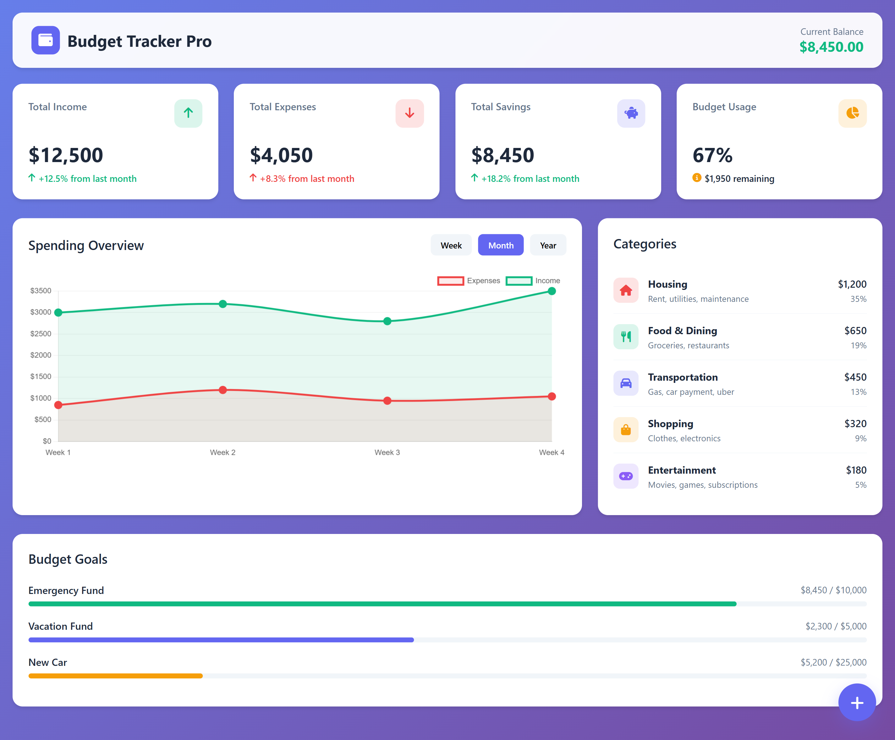
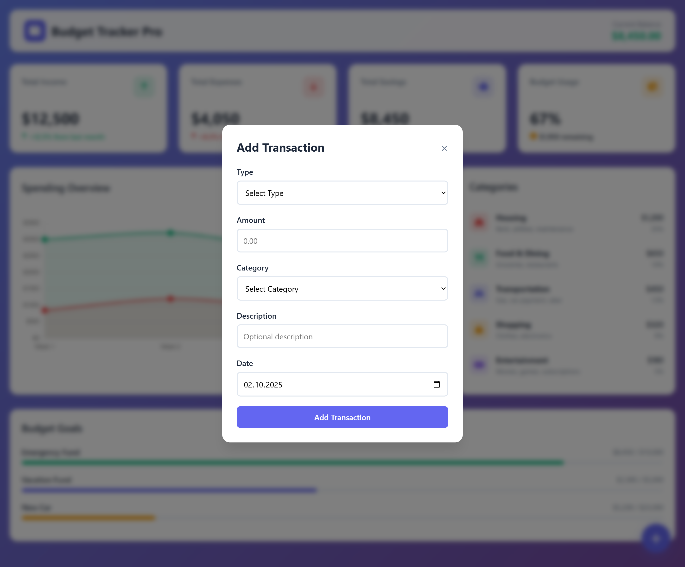

# 💰 Budget Tracker Pro

A modern, responsive personal finance management application built with pure HTML, CSS, and JavaScript.




## ✨ Features

### 📊 Financial Dashboard
- **Real-time Balance Tracking**: Current financial position at a glance
- **Summary Metrics**: Income, expenses, savings, and budget usage
- **Trend Indicators**: Visual indicators showing financial progress
- **Interactive Cards**: Hover effects and smooth animations

### 📈 Smart Analytics
- **Spending Overview**: Interactive line charts comparing income vs expenses
- **Time Period Filters**: Switch between weekly, monthly, and yearly views
- **Category Breakdown**: Visual spending distribution across categories
- **Progress Tracking**: Goal achievement with progress bars

### 🗂️ Expense Categories
- **Visual Organization**: Color-coded categories with custom icons
- **Percentage Analysis**: Clear breakdown of spending distribution
- **Common Categories**: Housing, Food, Transportation, Shopping, Entertainment
- **Flexible System**: Easy to add new categories

### 🎯 Budget Goals
- **Goal Setting**: Set and track financial targets
- **Progress Visualization**: Colorful progress bars with percentages
- **Multiple Goals**: Support for emergency funds, vacations, major purchases
- **Achievement Tracking**: Real-time progress updates

### ➕ Transaction Management
- **Quick Entry**: Floating action button for easy transaction input
- **Smart Categorization**: Pre-defined categories with custom options
- **Income & Expense Support**: Track both money in and money out
- **Form Validation**: Comprehensive input validation

## 🚀 Quick Start

### Installation
1. **Clone the repository**
   ```bash
   git clone https://github.com/yourusername/budget-tracker-pro.git# budget-tracker-pro
# budget-tracker-pro
